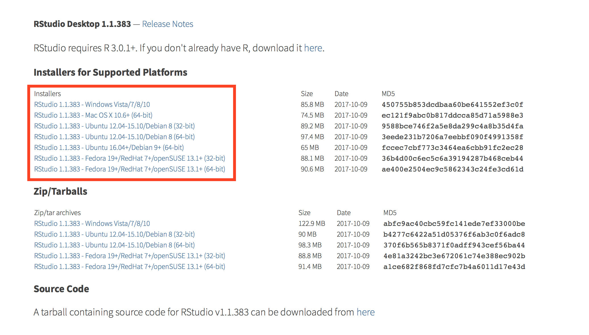

```{r setup, include=FALSE}
knitr::opts_chunk$set(echo = TRUE)
```

1. Go to https://www.rstudio.com/products/rstudio/download/#download

2. Select the installer for your operating system.

<div align="center">
  
</div>

3. Once file has downloaded, run and follow instructions. 

Once you have finished you should set up your [github account](http://www.jvcasillas.com/ru_teaching/ru_spanish_589/589_01_s2018/sources/tuts/github_setup/index.html)
