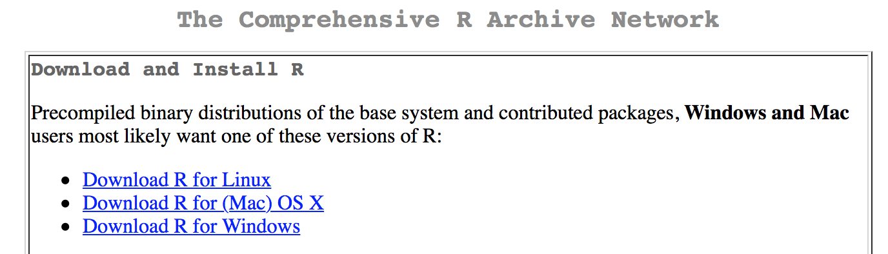
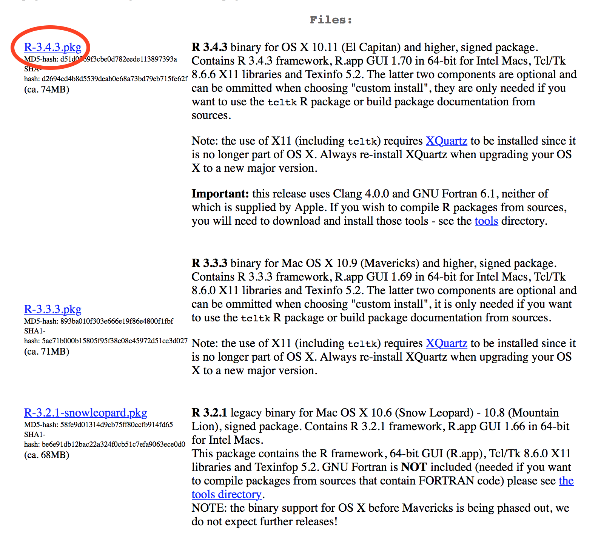

```{r setup, include=FALSE}
knitr::opts_chunk$set(echo = TRUE)
```

1. Go to https://cran.r-project.org

2. Select your operating system.

<div align='center'>
  
</div>

3. Select newest version of R (if possible), or whatever verfsion is most 
appropriate for you computer.

<div align='center'>
  
</div>

4. Once file has downloaded, run and follow instructions. 

Once you have finished you should download and set up [RStudio](http://www.jvcasillas.com/ru_teaching/ru_spanish_589/589_01_s2018/sources/tuts/rstudio_install/index.html)
